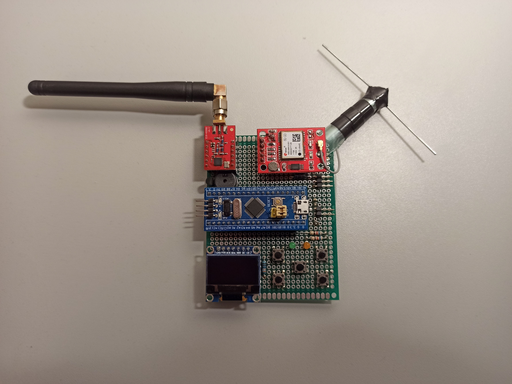
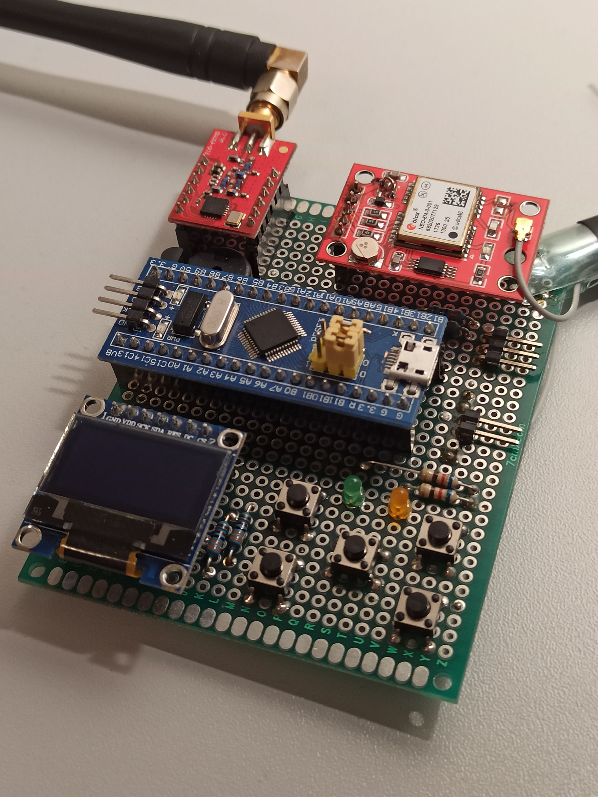
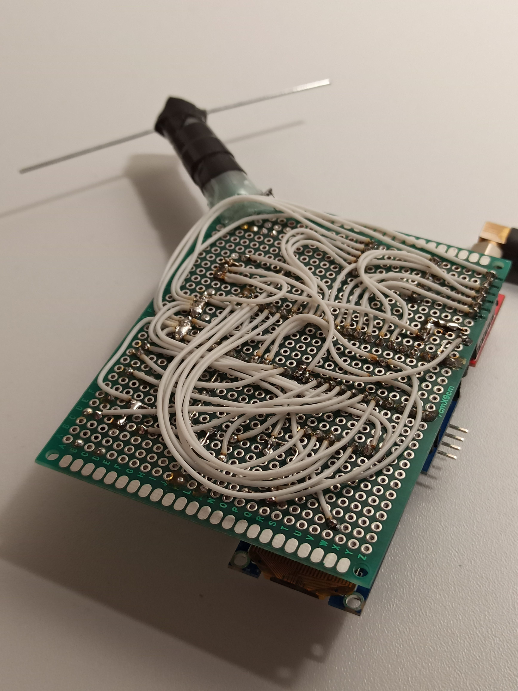

# Eleph Hardware
This folder contains hardware of the ELEPH

## Schematic
In the "**Schematic**" folder you can find PDF file with the schematic diagram.

* Please note that the schematic is **just for illustrative purposes**

In other words the schematic only shows the correct way to make connections. The reason is that Eleph is based on a cheap modular hardware, instead of discrete components. That is why i see no value in designing PCB, because there are a dozen of different modules available on the market, and the same amount of different PCB variations for each modules combinations. I am pretty shure that the schematic is simple enough to assemble it on breadboard, or to create your own PCB based on your modules.

## PCB
Due to the reasons mentioned above there is no PCB design for the project. Currently Eleph looks like shown below:

Overview | Top | Bottom
------- | ------- | -------
 |  | 

## Hardware
As you can see from the schematic, supply voltage VCC is 3.3V. Please make shure that all your modules have the same supply voltage and appropriate IO logic levels.
> For example, GPS module **Ublox Neo6M** used in the project, originally requires 5V supply voltage and uses onboard 3.3V LDO. That is why you have to depopulate LDO and solder a jumper between LDO's Vin and Vout pads to make GPS directly powered by your 3.3V source.

Also you may have noticed a strange GPS antenna. From the "GPS" point of view it is not correct to use linearly polarized dipole antenna, because GPS requires an antenna with Right Hand Circular Polarization. I was forced to make DIY GPS dipole due to the sh**ty ceramic patch antenna i got with the module was not able to pick up satellites even under the clear sky.

Couple of words about power supply. My supply chain is **_Single 18650 -> DC-DC Step-Up 5V -> LDO 3.3V_**. Such approach gives stable 3.3V output while 18650 changes it's state from charged (4.2V) to discharged (3.0V). BTW, i also use 18650 charging module with protection.
