# **ELEPH** - _Never Get Lost!_

  

  <i>Dedicated to my friend Alexander Sadaev, rock climber.</i>

Eleph is a GPS-based Local Relative Navigation System (LRNS) for group of up to 6 members. It allows you to share your positional data in **real-time** among other Eleph-devices and navigate to each of them in a relative manner by providing **Distance** and **Azimuth** information - like RADAR does.

## Demonstration

Before diving into the details, watch the demo on YouTube: <https://youtu.be/KRLeg57OE04>

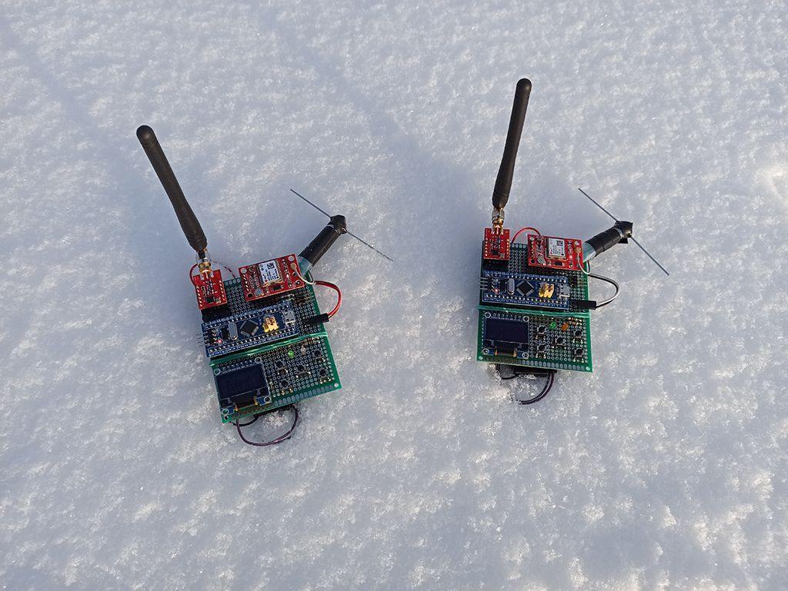

## Problem & Solution

As long as you stay under cell-coverage a navigation, either absolute or relative, is not a problem at all. You just use your phone with maps and messengers to find or share locations. Things change when you go off-grid. Hiking, skiing, sailing or whatever outdoor activity are a potential place to lose sight of your teammates. How to navigate in the group? Hopefully, there are couple of solutions available on the market:

* [LynQ](https://lynqme.com/pages/dev-consumer)
* [XQUAD](https://www.indiegogo.com/projects/xquad-smart-location-tracking-without-phones#/)
* [GoFindMe](https://www.indiegogo.com/projects/gofindme-a-gps-tracker-works-without-cell-service/#/)
* [GoTenna](https://gotennamesh.com/products/mesh)
* Also [GARMIN Dog collar](https://buy.garmin.com/en-US/US/c12522-p1.html)
* Also any [AIS](https://en.wikipedia.org/wiki/Automatic_identification_system) system

unfortunately all of them are commercial. But not the **Eleph**! 

**Eleph** is _open-source/open-hardware_ device which contains all major features needed for group navigation, such as:

* Detailed absolute positional information about each device in group
* RADAR-like interface with relative positional information about each device in group
* Memory slots to hold the position of any device and navigate it later
* GeoFence feature
* Timeout feature
* Alarm button

Due to open-source and simple and cheap hardware, Eleph is highly flexible solution that could be adapted to any use case you want:

* Hiking
* Climbing
* Sailing
* Hunting with the dogs
* Assets tracking
* and more...

## Technology

Eleph is written in pure C and runs on STM32 microcontroller. It has GPS module to receive positional data and synchronization signal, radio transceiver to exchange with radio packets between other devices, graphical display to show information on it, EEPROM memory IC to store coordinates, tactile buttons to control the device, buzzer to notify about events and couple of LEDs.

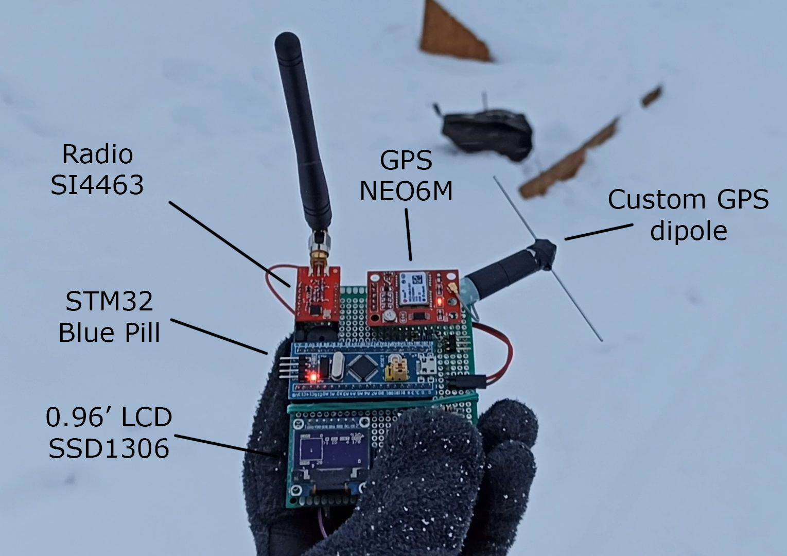

GPS module provides NMEA-0183 stream at 9600 baud. Microcontroller process the stream using DMA and parse it. Fields being extracted are RMC, GGA, GSA, GSV. Those give us information about time, date, latitude, longitude, speed, course, altitude, satellites in view and in use, navigation mode and validness of data.

GPS module also provides time synchronization signal - PPS. It is used as a time reference for the transmitting and receiving radio packets inside a current group of devices. Each group operates at the specific frequency channel, the way like regular radios. Each device in a group has unique predefined number from 1 to 6, so there are 6 members in a group maximum. Eleph uses TDMA technique to give channel access for each group member, so the device number corresponds to the time-slot occupied by device. There are 100 ms timer which starts counting from the rise of the PPS pulse. First 100 ms time-slot is used to parse and prepare positional data of the device. Next six time-slots are used to exchange with the positional data between devices via radio. A device is in TX state when time-slot number is equal to the device number, and in RX state otherwise. Remaining time before next PPS is reserved for relative positions calculation and displaying the results.

Eleph uses GFSK transceiver and operates in LPD 433 MHz band (please make sure you are allowed to use those frequencies in your region, change otherwise). Data rate is 3000 bps, deviation is 6000 Hz (mod index = 4), channel spacing is 25 kHz. Packet structure is shown below. It consist of 29 bytes total and takes ~78 ms to be transmitted over-the-air.

In order to calculate relative positions of other devices, Eleph uses two formulas. First one is [Haversine formula](https://en.wikipedia.org/wiki/Haversine_formula) which determines the distance between two points on a sphere. The second one is [Loxodrome formula](https://en.wikipedia.org/wiki/Rhumb_line) which determines bearing to a point on a sphere relative to true north. All calculations are performed with a highest possible, double precision, so the results are in a great agreement with my simulations on PC. Precision of the formulas is another matter. It is known that haversine formula is numerically better-conditioned for small distances, but on the other side it doesn't take into account ellipsoidness of the Earth and uses it's mean radius. Also it is known that loxodrome (or rhumb line) shows not-the-shortest way to reach point of interest (the shortest way is provided by orthodrome, or great circle route), but the constant bearing, which is more useful in practice. Anyway, my simulations using Google Earth Pro ruler leave me no concerns about accuracy of used formulas. According to them the error for both is less than 1% as long as the distance is smaller than 300 km (!).

  <i>(courtesy of <a href="https://www.esri.com/arcgis-blog/products/product/mapping/mercators-500th-birthday/">ESRI</a>)</i>

## User Manual

There are only 5 buttons: UP and DOWN to scroll, OK to select, ESC to go back. The last one called PWR, but actually it switches alarm on and off. There are two actions with a button - short click or press & hold. Navigation through menu is intuitive, otherwise you will be notified about possible actions.

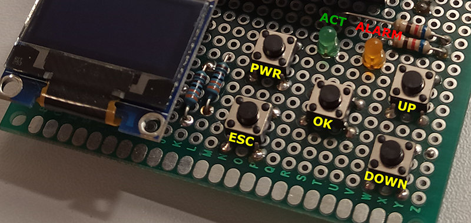

---

#### Main Menu

After power up you start with main menu. Note the 'note' icon at the top right corner. It shows sound indication status. Press & hold ESC button in any menu to switch mute - '!' symbol will appear if sound is muted.

  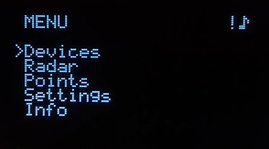

---

#### Main Menu -> Devices

"Devices" is the first of main screens. Here you can see the list of all devices online. First two rows describes "this" device (device that you hold in hand). They contain:
* **#** - This device number
* **ID** - Two characters ID of this device, only letters in capital
* **SOG** - Speed over Ground of this device, in kilometers per hour
* **COG** - Course over Ground of this device, in degrees related to the true North
* **AALT** - Absolute altitude of this device above mean sea level, in meters
* **Up and down arrows** - indicates that this device is on-air, i.e. synchronized with PPS and transmits & receives radio packets
* **Satellites signal indicator** - Has three bars: 1 bar - only GPS time is fixed; 2 bars - 2D fix (shown); 3 bars - 3D fix; shows 'X' otherwise
* **Battery indicator** - This device battery level; has 5 levels; empty is shown

  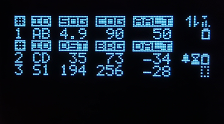

Other rows show other devices online. They contain:
* **#** - Other device number
* **ID** - Two characters ID of other device. If a device ID is something from "S1" to "S6" that means the row contains a GPS point loaded from the memory slot №1 to №6 respectively
* **DST** - Distance to that device/point, in meters
> (!) Values representation note: if any quantity doesn't contain decimal point in the value, that means the value is in _units_, otherwise the value is in _kilounits_. Example: DST = "35" means 35 meters; DST = "3.5" means 3.5 kilometers; DST = "35." means 35 kilometers.
* **BRG** - Bearing (azimuth) to that device/point, in degrees related to the true North
* **DALT** - Delta of altitudes to that device/point, in meters, signed. Positive values means that a device/point is above you, under otherwise
* **Bell** - Alarm indicator; that device has enabled alarm; buzzer will beep each time an alarm is received from any device
* **Sandglass** - Timeout occur for that device/point; buzzer will beep if timeout feature is enabled
* **Battery indicator** - Battery level of that device
* **Fence indicator** - That device/point is out of the virtual geo fence; work only in horizontal plane, i.e. fence for DST, excluding DALT; buzzer will beep if fence feature is enabled

---

#### Main Menu -> Devices -> Each Device (in case of "this" device)

When you press OK in "Devices" menu you will go to the menu called "Each Device". In that menu you could scroll up and down through all online devices. In case of this device is shown you get screen like shown below:

  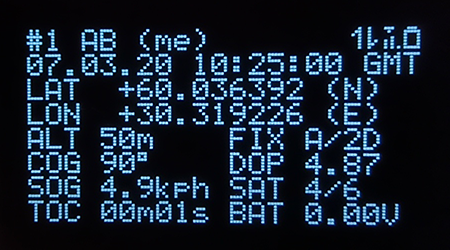

* **# ID (me)** - Indicates the number of this device, it's ID and _(me)_ prompt
* **DD.MM.YY HH.MM.SS GMT** - Date and time in the described format
* **LAT** and **LON** - Latitude and Longitude in decimal degrees, signed; in addition to the sign a northing and easting indicators are shown
* **ALT** - Absolute altitude of this device above mean sea level, in meters
* **COG** - Course over Ground of this device, in degrees related to the true North
* **SOG** - Speed over Ground of this device, in kilometers per hour
* **FIX** - GPS fix status; V - invalid data; A - valid data; NO/2D/3D - fix type
* **DOP** - Positional Dilution of Precision; it is good when DOP < 6
* **SAT** - Number of satellites in-view/in-use
* **BAT** - This device battery voltage
* **TOC** - Timeout counter; counts time since last GPS fix

---

#### Main Menu -> Devices -> Each Device (in case of another device)

When another device is displayed, the "Each Device" menu looks slightly different. Besides already described LAT, LON, ALT, DLT (delta altitude), BRG, SOG, COG, DST and BAT there are additional info:

* **FIX** - 2D/3D fix type and LO/HI indicator; HI when DOP < 6, LO otherwise
* **TOC** - Counts time since last radio packet received from that device
* **FNC** - Fence alarm indicator
* **ALR** - Alarm indicator (main alarm, which is controlled manually by PWR button)

  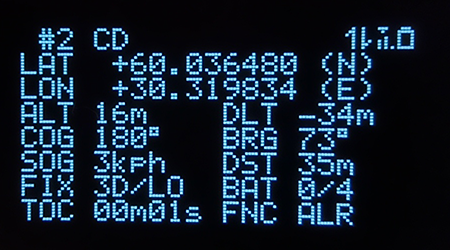

When any kind of alarm is triggered, an alarm indicator is printed in negative:

  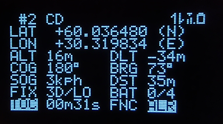

---

#### Main Menu -> Devices -> Each Device (in case of memory point)

When a memory is selected during scroll, you will get:

  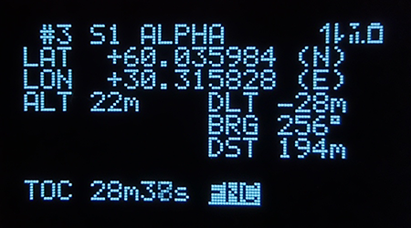

Since a memory point holds only LAT, LOT and ALT, the parameters you get are delta in altitudes, bearing and distance. The only type of alarm for a memory point is a fence alarm. TOC counts since you have loaded memory point to the list of devices online.

---

#### Main Menu -> Devices -> Each Device -> Options

By pressing OK in "Each Device" menu you could open options menu:

  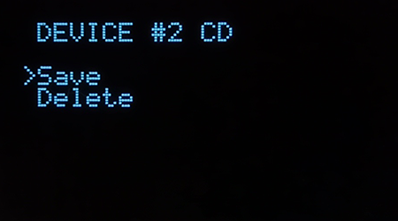

When you choose "Save", you will be asked which memory slot you want to use to save a device. There are 5 memory slots total and only empty are shown. During the saving you should input 5-characters point name; current date will be automatically saved too.

  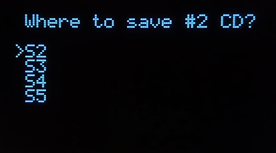

Also you could delete any device from the list of active devices by pressing "Delete". This works with both memory points and other devices. If you delete any other device which is online, it will disappear for a while and then appear again at the next packet reception.

  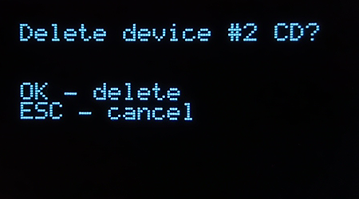

---

#### Main Menu -> Radar

"Radar" is the second of main screens. It is a quintessence of the Eleph. The radar itself is a rectangle on the left. Top, right, bottom and left sides of the radar are North, East, South and West respectively. Single center dot is you, other devices or points are crosshairs with solid or void center - depends on selected or not respectively. Selection indicator in the list is a ">" cursor. There is your COG above radar, and radar range indicator **RNG** below. RNG shows the radius of the radar in meters; it changes with 20 meters increment. 

  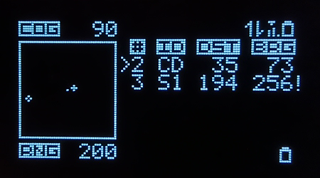

When you scroll through devices, the bottom bar shows you flags of the currently selected device. In case of memory point it also shows a point name:

  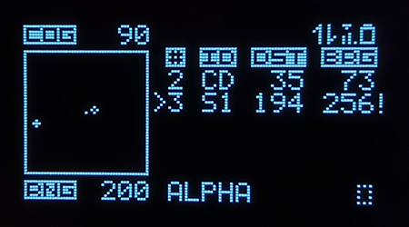

Also note the "!" sign ant the end of the row - that meant that this device has at least one of the alarm flags set (timeout, fence or alarm). 

You have the ability to hide any device on the radar screen, just press OK on selected device - its number will appear in negative and it will disappear from the radar (but not from the list):

  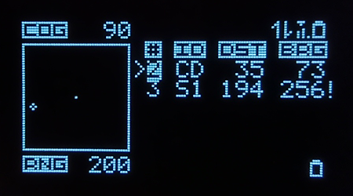

Note that when you hide any devices, the radar range RNG will be automatically adjusted to the farest unhided device:

  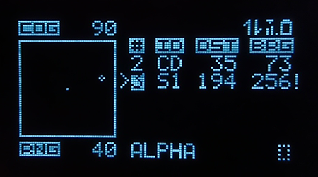

---

#### Main Menu -> Points

When you access "Points" menu, you will see the list of all 5 memory slots. Here are a slot name, point name and date of save:

  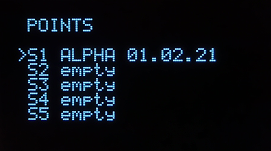

Select any of them to open options:

  

If you want to load a point to the list of online devices, just specify the device number to load in; only vacant devices are shown:

  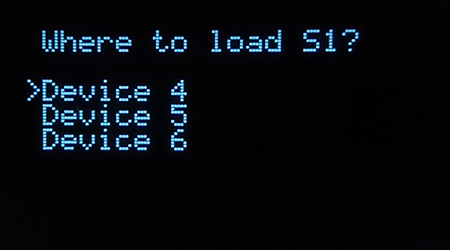

---

#### Main Menu -> Settings

The last but not the least is the "Settings" menu:

  

Here you can edit them, restore the default settings or erase all EEPROM including memory points. When selecting "Edit" you will see the page with all Eleph's parameters:

  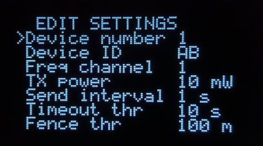

* **Device number** - This device number, 1 to 6
* **Device ID** - This device ID
* **Freq channel** - LPD frequency channel, #1 corresponds to 433.075 MHz, #2 to 433.100 MHz, etc
* **TX power** - Radio output power; 10, 25, 40, 100 mW.  Make sure you are allowed to use higher powers. Also note that some SI4463 modules don't have an antenna switch, if so do not use powers higher than 25 mW
* **Send interval** - Send radio packets each: 1, 5, 10, 30, 60 seconds. Be careful when select values other than 1 s because sometimes a GPS did not receive Leap Second correction yet and gives GPS time instead of UTC time. GPS and UTC time are not the same, so this will break synchronization between devices until all devices will receive Leap Second correction frame (transmitted by the GPS every 12.5 minutes)
* **Timeout thr** - Timeout alarm threshold in seconds with 10 s increment; timeout alarm is disabled if 0
* **Fence thr** - Fence alarm threshold in meters with 10 m increment; fence alarm is disabled if 0

---

#### Main Menu -> Info

Here you can get info about hardware/firmware revision and build date:

  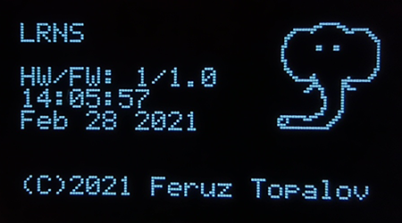

---

## FAQ

* _**Why is it called Eleph?**_ -Eleph stands for elephant. Elephants are a social animals, they form close bonds and stay in-touch - that is the main aim of the Eleph device.
* _**Why not LoRa?**_ -Believe or not, but i see no reason to use LoRa in the Eleph now. Mainly due to high price. Also the benefit in longer range is an object to investigate - i have doubts about it. But if the project will be further developed, i am not ruling out a switching to the LoRa modem, because most of the LoRa modems support FSK too - that is a good opportunity to try.
* _**Why there is no compass?**_ -When i started the project i thought that COG (Course over Ground) information from the GPS would be enough, and that the COG relates to the true north, while compass gives magnetic north. Obviously information about true north is more valuable. To my dismay i found such approach not working satisfyingly - my very old GPS module is too inaccurate in COG estimation... So better use newer GPS chips or your mechanical compass, or learn how to navigate using the Sun.
* _**Why there is no PCB designed?**_ -~~Partly due to my laziness,~~ but i would say: due to the hardware is fully modular, and some modules like GPS or radio you are able to get may differ from my. That is a headache to find certain modules - that is why i give you a freedom in building your own Eleph from a garbage of modules that lying on the shelf since ArDuInO times. Have another GPS? Use it! Have different radio? Modify the code and use it!
* _**Any plans to resume the project?**_ -Hope so. But more likely there will be a new generation of Eleph, with modern hardware, different interface and feature-set. Anyway i will try my best to support any enthusiast who wants to build the Eleph or participate in the project.
* _**How can i support the project?**_ -Eleph really needs your support. Main functionality is tested, but full and comprehensive outdoor tests are nor performed yet. You could build it, test it on your side and report an issue if so - that is the best way to support.
